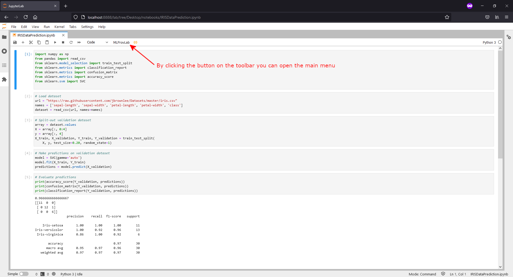
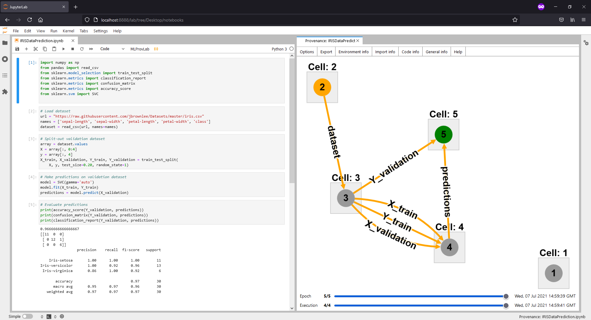
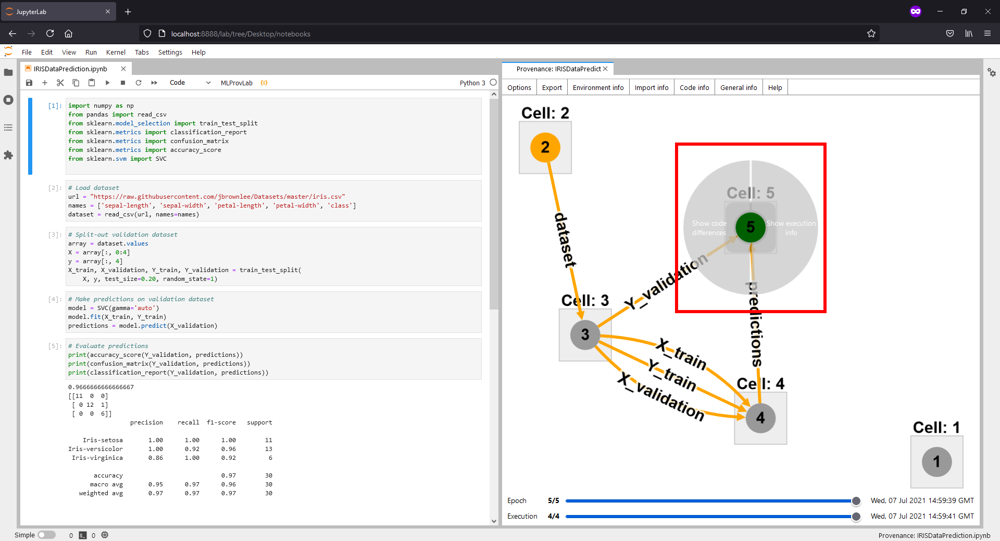
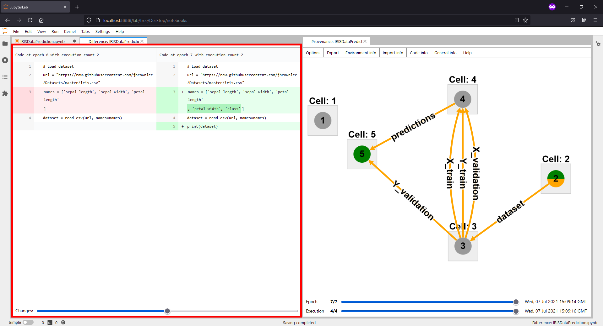
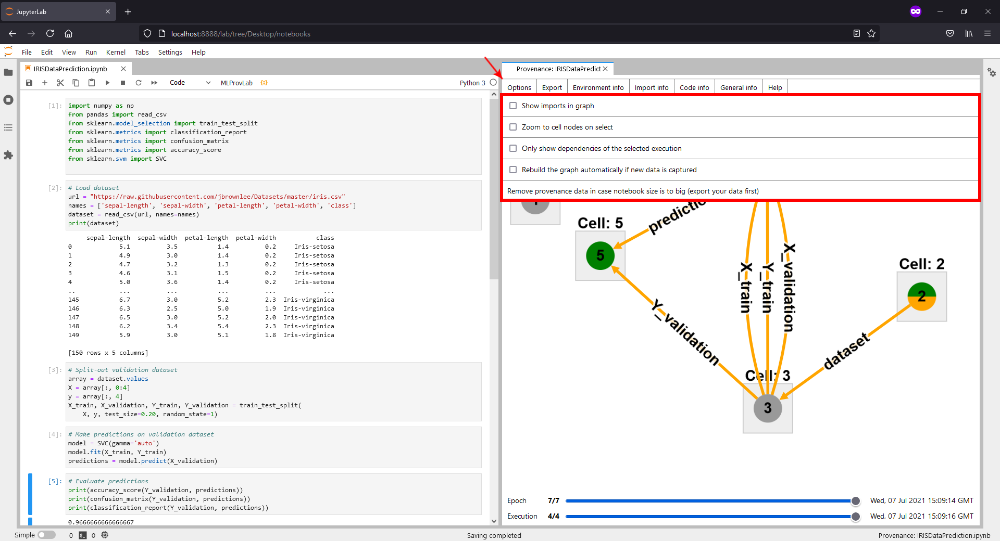
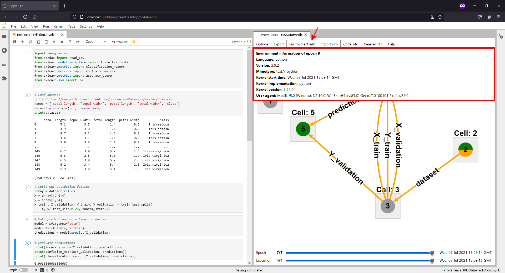
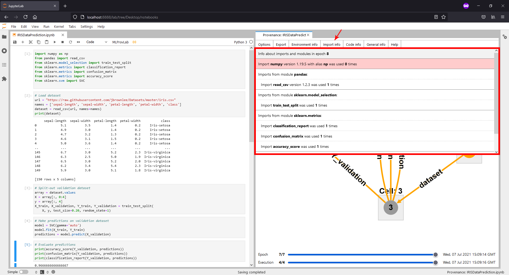
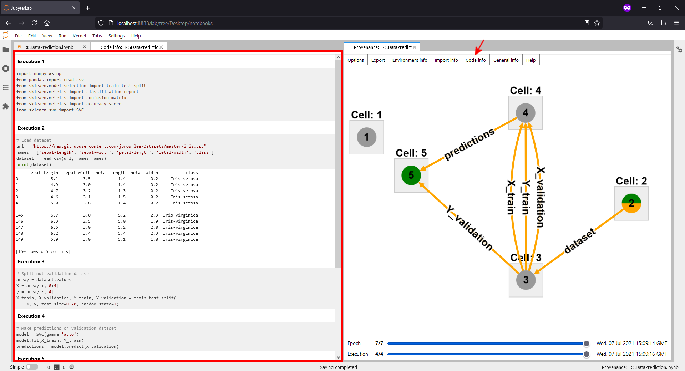
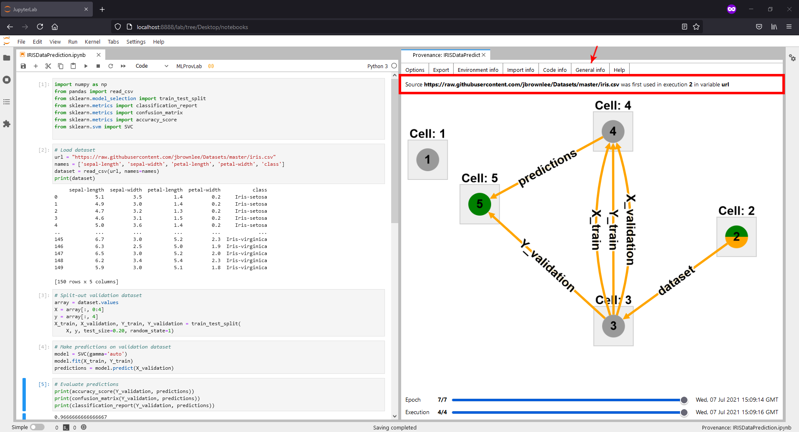

# MLProvLab

## Opening the main menu

By clicking the toolbar button you can open the main menu.

With the sliders on the bottom you can change the current displayed epoch and the latest execution displayed.

## Execution Graph

You can move all nodes in the graph by dragging them to the desired position.
By right clicking and holding you can open a context menu.
You can select an option by moving you mouse to it and releasing the right button.

If you open the menu on a node, you can either open the execution info widget or the code difference widget.
If you open it on an edge you can open the execution info of the represented variable.
If you click on a node group you can focus the corresponding cell in the notebook.

## Execution info widget

Here you can see all the information about variables collected in an execution.

## Code difference widget

Here you can see the changes that where made to the code of a cell.
On the right side you see the code of the execution you opened the widget with.
On the other side you can select older version trough the slider on the bottom.

## Options menu

Here you can select options to show more information on the graph.

## Environment information

By clicking the button highlighted beneath you can open information about the environment of the epoch.

## Import information

Clicking the import info button will open the information about all external modules that where used

## Code information

To open a notebooks styled widget that display's the code that got executed in your selected epoch, click the code info button.

## General information

The general information will display all data sources that where used during the selected epoch.

